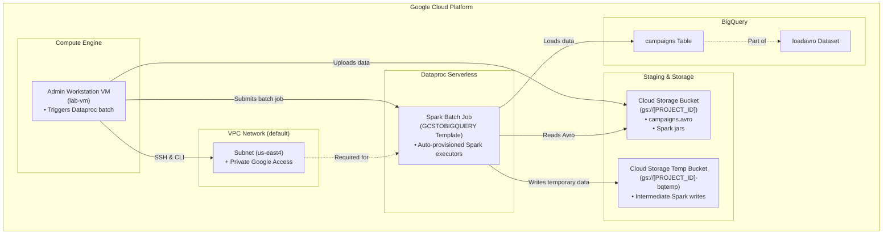
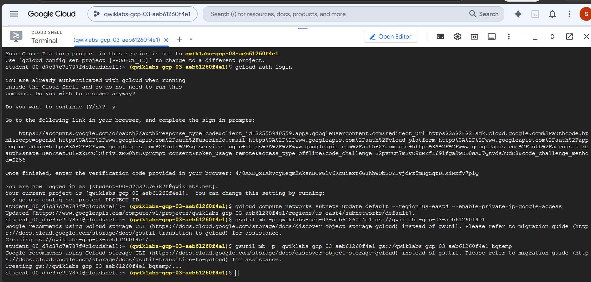
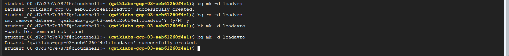
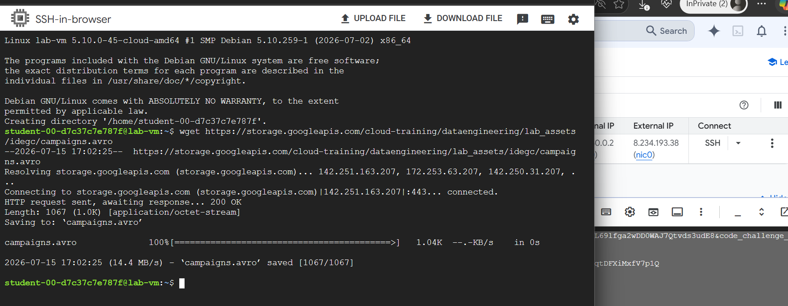
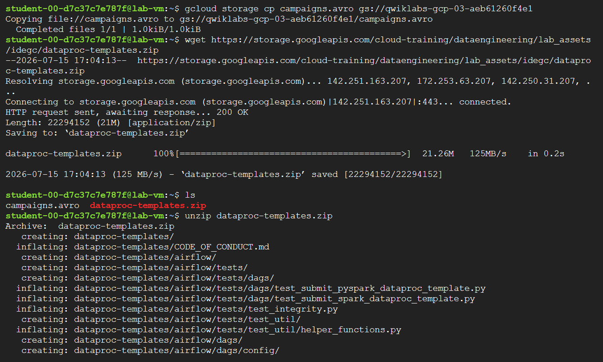
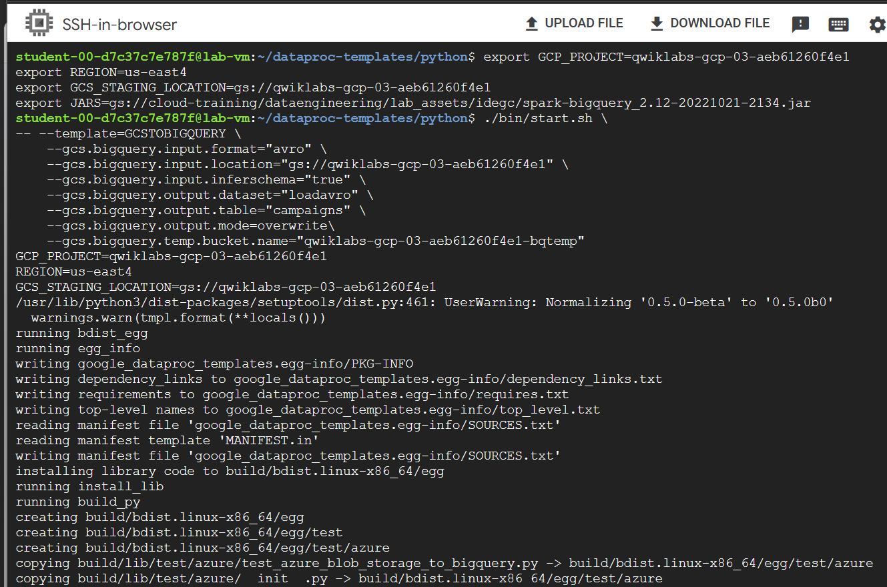
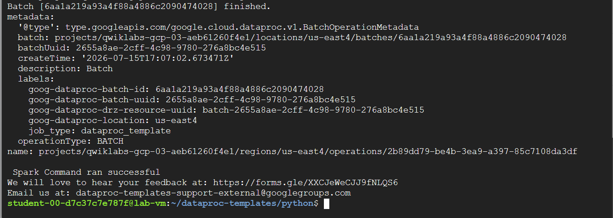
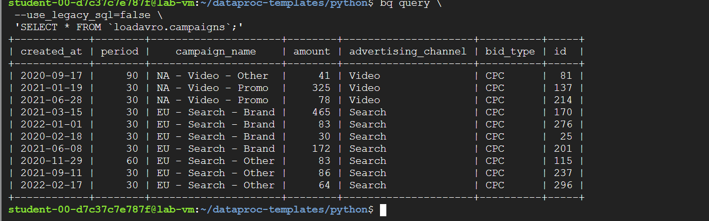

# <div align="center">Serverless Apache Spark to BigQuery Data Pipeline</div>

## Executive Summary
This repository contains the architecture, configuration, and implementation steps to execute an ephemeral data loading pipeline on Google Cloud. It uses Dataproc Serverless <!-- TODO: add official doc link --> to run an Apache Spark batch job that processes an Avro format campaign log stored in Cloud Storage <!-- TODO: add official doc link --> and loads it directly into BigQuery <!-- TODO: add official doc link -->.

## Architecture Overview



This architecture outlines an event-driven, zero-ops ETL pipeline. The admin workstation VM downloads and stages data to Cloud Storage. The Dataproc Serverless batch job is triggered asynchronously, reading the source Avro dataset from GCS, using a GCS temp bucket for staging, and loading the output into a BigQuery table. Communication between Dataproc Serverless and Google APIs is kept private within the VPC network using Private Google Access.

## Business Problem
Enterprise organizations processing massive, spiky data streams often face challenges in maintaining Apache Spark clusters. Provisioning, scaling, and managing infrastructure for ephemeral, once-a-day ETL jobs results in high administrative overhead and significant resource idle-state costs. 

To run these workloads efficiently, enterprises need a solution that scales compute resources on demand, executes jobs in isolation, and charges only for the exact duration of the job without requiring the manual tuning of Hadoop/Spark configurations.

## Solution Overview
This repository addresses the business challenge by leveraging a serverless Apache Spark execution environment. Instead of maintaining a persistent cluster, the PySpark workload is submitted as an ephemeral batch job using the pre-built `GCSTOBIGQUERY` template from the Google-provided Dataproc Templates suite. 

The pipeline extracts the data from an Avro file in Cloud Storage <!-- TODO: add official doc link -->, infers its schema dynamically, writes intermediate Spark data to a temporary GCS bucket, and loads the structured data into a BigQuery <!-- TODO: add official doc link --> table. The pipeline is zero-ops, highly scalable, and cost-effective.

## Reference Architecture

### Core Google Cloud Services Used
* **VPC Network** — [docs](https://cloud.google.com/vpc/docs) — Used the default subnet with Private Google Access enabled to allow Dataproc Serverless executors to privately access GCS and BigQuery without public IP addresses.
* **Cloud Storage (GCS)** — [docs](https://cloud.google.com/storage/docs) — Used to store the input Avro datasets and act as a temporary bucket for the BigQuery connector to stage data.
* **BigQuery** — [docs](https://cloud.google.com/bigquery/docs) — Used as the destination data warehouse for structured campaign data, enabling low-latency SQL query execution.
* **Compute Engine VM** <!-- TODO: add official doc link --> — Used as an administrative workbench workstation (`lab-vm`) to download code assets, stage source files, and orchestrate batch execution.
* **Dataproc Serverless** <!-- TODO: add official doc link --> — Used to run the PySpark template as a batch workload, allowing on-demand execution of Spark code with per-second billing.

### Design Decisions & Trade-offs

#### 1. Dataproc Serverless vs. Persistent Dataproc Clusters
* **Choice**: Dataproc Serverless <!-- TODO: add official doc link -->.
* **Why**: Avoids operational overhead for cluster scaling, OS tuning, and capacity management. Fits the episodic, batch nature of our loading job.
* **Trade-off**: Cold-start latency of approximately 1-2 minutes while the containerised Spark environment is spun up. Not recommended for sub-second, real-time streaming where instant execution is required.

#### 2. Spark BigQuery Connector Staging vs. Direct Streaming API Ingestion
* **Choice**: Staging via GCS temp bucket (`--gcs.bigquery.temp.bucket.name`).
* **Why**: The BigQuery connector uses a write-then-load pattern where intermediate Spark tasks write data to GCS as Avro/Parquet format, and then trigger a BigQuery Load job. This provides high throughput and avoids BigQuery streaming ingestion limits and API costs.
* **Trade-off**: Requires staging bucket lifecycle management to clean up residual temporary files, and introduces GCS I/O overhead.

#### 3. Private Google Access vs. NAT Gateway for Outbound Connectivity
* **Choice**: Subnet-level Private Google Access.
* **Why**: Dataproc Serverless executors lack external IP addresses. Enabling PGA allows them to reach Google API endpoints securely over Google's internal network.
* **Trade-off**: Restricts the executors to communicating only with GCP services that support PGA within the VPC boundary, requiring dedicated VPC routing.

## Prerequisites
* **Google Cloud Project** with billing enabled.
* **Identity and Access Management (IAM)** roles:
  * `roles/dataproc.editor`
  * `roles/storage.admin`
  * `roles/bigquery.admin`
  * `roles/compute.admin`
* **VPC Subnet** configured with Private Google Access enabled.
* **Administrative VM** (Compute Engine instance) to orchestrate execution.

## Repository Structure
```text
.
├── images/
│   ├── bigquery-data-verification.png       # Screenshot verifying loaded BigQuery table
│   ├── bigquery-dataset-creation.png        # Screenshot of the BigQuery dataset creation
│   ├── bigquery-dataset-initial-setup.png   # Screenshot showing dataset setup attempt
│   ├── gcp-private-access-setup.png         # Screenshot of Private Google Access and bucket setups
│   ├── spark-job-environment-setup.png      # Screenshot of the exported variables
│   ├── spark-job-execution-success.png      # Screenshot of the Spark batch execution output
│   ├── vm-asset-download-and-staging.png    # Screenshot showing asset unzipping in the VM
│   └── vm-ssh-connection.png                # Screenshot of the SSH VM connection and file download
└── README.md                                # Enterprise-grade documentation file
```

## Environment Variables
The following environment variables must be defined on the administrative workstation prior to executing the start script:

```bash
# Define target Google Cloud Project ID
export GCP_PROJECT="qwiklabs-gcp-03-aeb61260f4e1"

# Define target Google Cloud Region (must match VPC subnet region)
export REGION="us-east4"

# Define primary GCS staging location for PySpark templates
export GCS_STAGING_LOCATION="gs://qwiklabs-gcp-03-aeb61260f4e1"

# Path to the BigQuery connector jar required by the Spark session
export JARS="gs://cloud-training/dataengineering/lab_assets/idegc/spark-bigquery_2.12-20221021-2134.jar"
```

---

## Implementation

### Phase 1: Infrastructure and Network Configuration
To support Serverless for Apache Spark batches, we must update the regional subnet to allow private connectivity, provision GCS storage buckets, and prepare the target BigQuery dataset.

1. **Enable Private Google Access** on the default VPC network subnet in the target region:
   ```bash
   gcloud compute networks subnets update default \
     --region=us-east4 \
     --enable-private-ip-google-access
   ```

2. **Create Cloud Storage Buckets** for Spark staging and BigQuery temporary storage:
   ```bash
   # Staging bucket
   gsutil mb -p qwiklabs-gcp-03-aeb61260f4e1 gs://qwiklabs-gcp-03-aeb61260f4e1

   # BigQuery temporary staging bucket
   gsutil mb -p qwiklabs-gcp-03-aeb61260f4e1 gs://qwiklabs-gcp-03-aeb61260f4e1-bqtemp
   ```

   <p align="center">
     
   </p>

3. **Create the target BigQuery Dataset** to store the processed campaigns table:
   ```bash
   bq mk -d loadavro
   ```

   <p align="center">
     
   </p>

---

### Phase 2: Administrative Workstation Setup and Asset Staging
Execute these steps from the terminal of the Compute Engine VM to download the source dataset, move it to GCS, and set up the PySpark Dataproc templates.

1. **Download and stage the Avro campaigns file**:
   ```bash
   # Download the raw campaigns Avro file
   wget https://storage.googleapis.com/cloud-training/dataengineering/lab_assets/idegc/campaigns.avro

   # Copy the file to the Cloud Storage staging bucket
   gcloud storage cp campaigns.avro gs://qwiklabs-gcp-03-aeb61260f4e1
   ```

   <p align="center">
     
   </p>

2. **Download and extract the Dataproc Templates**:
   ```bash
   # Download the templates zip archive
   wget https://storage.googleapis.com/cloud-training/dataengineering/lab_assets/idegc/dataproc-templates.zip

   # Extract the zip file and navigate to python scripts
   unzip dataproc-templates.zip
   cd dataproc-templates/python
   ```

   <p align="center">
     
   </p>

---

### Phase 3: Spark Job Configuration and Execution
Initialize the execution environment and launch the template batch job on Dataproc Serverless.

1. **Set Environment Variables**:
   ```bash
   export GCP_PROJECT=qwiklabs-gcp-03-aeb61260f4e1
   export REGION=us-east4
   export GCS_STAGING_LOCATION=gs://qwiklabs-gcp-03-aeb61260f4e1
   export JARS=gs://cloud-training/dataengineering/lab_assets/idegc/spark-bigquery_2.12-20221021-2134.jar
   ```

   <p align="center">
     
   </p>

2. **Execute the Spark Batch Job**:
   Run the PySpark wrapper script to submit the `GCSTOBIGQUERY` template workload:
   ```bash
   ./bin/start.sh \
     -- --template=GCSTOBIGQUERY \
         --gcs.bigquery.input.format="avro" \
         --gcs.bigquery.input.location="gs://qwiklabs-gcp-03-aeb61260f4e1" \
         --gcs.bigquery.input.inferschema="true" \
         --gcs.bigquery.output.dataset="loadavro" \
         --gcs.bigquery.output.table="campaigns" \
         --gcs.bigquery.output.mode=overwrite \
         --gcs.bigquery.temp.bucket.name="qwiklabs-gcp-03-aeb61260f4e1-bqtemp"
   ```

   > [!NOTE]
   > Spark dynamically infers the schema of the Avro input when `--gcs.bigquery.input.inferschema` is set to `true`.

   <p align="center">
     
   </p>

---

## Verification
Confirm that the Spark template successfully populated the target BigQuery database by querying the `campaigns` table:

```bash
bq query \
  --use_legacy_sql=false \
  'SELECT * FROM `loadavro.campaigns`;'
```

<p align="center">
  
</p>

---

## Observability
* **Cloud Logging**: All logs generated by the Spark batch execution are piped directly to Google Cloud Logging under the resource type `Cloud Dataproc Batch`. You can filter logs by project, region, and batch ID.
* **Dataproc Batch Console**: Navigate to **Dataproc** > **Batches** in the GCP Console to track job status, compute duration (in DCUs), RAM/VPC resource usage, and standard output/error outputs.

---

## Troubleshooting

> [!WARNING]
> If a batch job fails on launch, verify that Private Google Access is enabled on the subnetwork assigned to the region. Dataproc Serverless cannot initialize nodes in a subnet lacking PGA.

> [!NOTE]
> **Warning**: `WARN FileStreamSink: Assume no metadata directory. Error while looking for metadata directory...`
> This warning is safe to ignore during development or testing. Dataproc Templates write data files directly, and a Spark metadata directory is not required for standard loading operations.

> [!TIP]
> If you encounter network-related connection timeouts or batch environment preparation failures, verify that the region of your staging buckets, BigQuery dataset, and administrative VM matches the region specified in the `REGION` environment variable (`us-east4`).

---

## Cleanup
To prevent ongoing charges to the Google Cloud account, run the following commands to delete the resources provisioned in this lab:

> [!CAUTION]
> Deleting the BigQuery dataset and Cloud Storage buckets is destructive and cannot be undone. Verify all project IDs before executing.

1. **Delete the BigQuery dataset and tables**:
   ```bash
   bq rm -r -f loadavro
   ```

2. **Delete the Cloud Storage buckets**:
   ```bash
   # Remove staging and temporary GCS buckets
   gsutil rm -r gs://qwiklabs-gcp-03-aeb61260f4e1
   gsutil rm -r gs://qwiklabs-gcp-03-aeb61260f4e1-bqtemp
   ```
